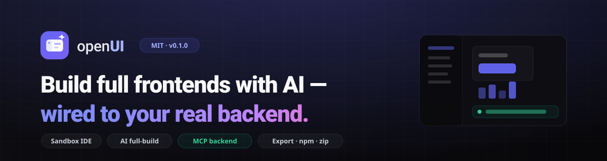

<p align="center">
  
</p>

<p align="center">
  <a href="https://github.com/GC-0719/openUI/actions/workflows/ci.yml"></a>
  
  =20" />
  
  
</p>

# openUI

openUI is a studio you run on your own machine where an AI agent builds complete
React apps from a design-system kit — creating pages, components, hooks, and
services across a real project tree, wired to *your* backend through
[MCP](https://modelcontextprotocol.io). Edit files in a built-in IDE, preview
the running app live, then export or publish your kit under your own name.

> Bring your own AI key (Anthropic, OpenAI, Gemini, or a local LLM). Nothing
> leaves your machine except the AI calls you make.

---

## Features

- **Sandbox IDE** — recursive project file tree with create/rename/delete, a
  code editor, and a live preview of the running app.
- **AI full-build agent** — describe a feature and the agent writes pages,
  components, hooks, and `lib/` services across the project, auto-fixing its
  own syntax errors.
- **Backend-aware via MCP** — connect a backend MCP server; the agent sees its
  tools and live data and builds a data layer + UI that match your exact fields.
- **Design-system kit** — 24 polished React components (Angular kit included),
  with a kit name and CSS prefix you can rename in one click.
- **Export & publish** — download a ZIP, push to GitHub, generate an MCP
  server, or publish your kit to npm **under your own name**.

## Quick start

Requires **Node 20+**.

```bash
npm install
OPENUI_AI_KEY=sk-ant-... npm run dev      # React studio
# or open the studio and add your key in Settings
```

Open the printed URL, click **Open the Studio**, and start building.

> **One install is enough.** A single root `npm install` is all you need to run
> the studio and preview **both** kits — the React and Angular kits compile from
> the root's dependencies via the studio's Vite dev server. There are no npm
> workspaces and no separate installs inside `kits/*`. (The per-kit
> `package.json` files exist only for **publishing** the packages — see
> [RELEASING.md](RELEASING.md) — and aren't needed to develop or preview.)

> `npm run dev:angular` launches the Angular workspace. `OPENUI_AI_KEY` is
> optional — you can also paste a key into the in-app AI settings (stored only
> in your browser's localStorage).

## AI providers

openUI proxies your chosen provider through the local dev server (`/api/ai`):

| Provider   | Key source                                   |
|------------|----------------------------------------------|
| Anthropic  | `OPENUI_AI_KEY` / `ANTHROPIC_API_KEY` or in-app settings |
| OpenAI     | in-app settings                              |
| Gemini     | in-app settings                              |
| Local LLM  | Ollama / OpenAI-compatible base URL          |

## Architecture

```
src/                 The studio app (React 19 + Vite + react-router)
  pages/             Landing (Home) + Studio
  components/studio/ FileExplorer, CodeEditor, AIAgent, preview, audit…
  services/          aiService (prompts/parsing), mcpClientService
kits/
  react/{template,workspace}    24-component React kit (publishable @openedui/react)
  angular/{template,workspace}  Angular kit
vite.config.js       Custom dev-server backend: /api/ai, workspace file CRUD,
                     MCP bridge, /api/export (zip + generated MCP server)
```

The **workspace** is your editable copy of a kit; the **template** is the
pristine source. The agent writes files into the workspace via the dev server,
and the preview iframe renders the running workspace app.

## Using the kit in your own project

**React:**
```bash
npm install @openedui/react
```
```jsx
import { Button, Card, Badge } from '@openedui/react';
import '@openedui/react/styles.css';
```

**Angular** (standalone components):
```bash
npm install @openedui/angular
```
```ts
import { ButtonComponent, CardComponent } from '@openedui/angular';
import '@openedui/angular/styles.css';
```

## Export & publish your kit

In the studio, **Export** lets you download a full project ZIP (with a
publishable `package/` named after your kit + optional npm scope), push to
GitHub, or generate an MCP server. See [RELEASING.md](RELEASING.md).

## Contributing

See [CONTRIBUTING.md](CONTRIBUTING.md). By participating you agree to the
[Code of Conduct](CODE_OF_CONDUCT.md).

## Security

openUI's dev server reads and writes files and can spawn MCP processes. It is a
**local development tool** — never expose it to a network or untrusted input.
See [SECURITY.md](SECURITY.md).

## License

[MIT](LICENSE) © openUI contributors
